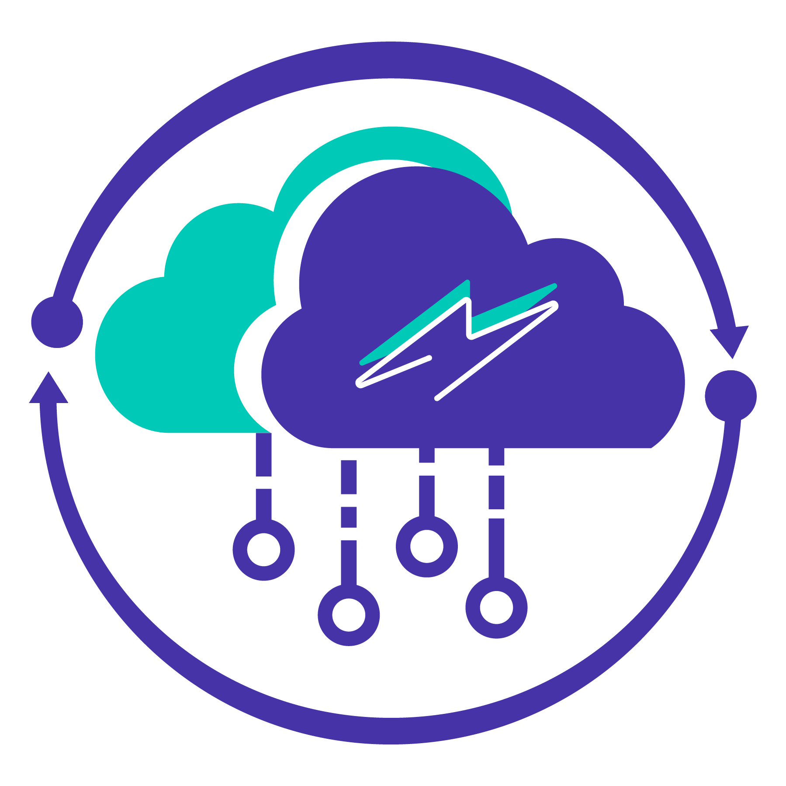

# 📚 Endora Documentation

<div align="center">



**Comprehensive documentation for Endora Backend as a Service Platform**

_Smarter Backend, Faster Development_

<div align="center">

   

</div>

</div>

---

## ✨ What is Endora Docs?

This is the official documentation website for Endora, built with **Docusaurus 3**. It provides comprehensive guides, API references, tutorials, and best practices for developers using the Endora Backend as a Service platform.

Built by students at the **Institute of Science and Technology Advanced Development (ISTAD)** in Cambodia, this documentation helps developers quickly understand and leverage Endora's powerful features.

---

## 🎯 Documentation Content

### 📖 Core Documentation

- **Introduction** - Overview of Endora platform and capabilities
- **Getting Started** - Quick start guide for new users
- **Schema Creation** - How to design and create database schemas
- **API Generation** - Automatic REST API creation from schemas
- **Authentication** - User authentication and authorization setup
- **Security Configuration** - Best practices for securing your APIs

### 🛠️ Advanced Guides

- **Deployment** - Deploy your Endora projects to production
- **Data Population** - Strategies for populating and managing data
- **Performance** - Optimization tips and best practices
- **API Reference** - Complete API endpoint documentation
- **Swagger Testing** - Using Swagger UI for API testing
- **Postman** - Working with Postman collections

### ❓ Support

- **FAQ** - Frequently asked questions and troubleshooting

---

## 🚀 Deployment

This documentation site is deployed and accessible at:

**📚 Live Docs**: [https://docs.endora.space](https://docs.endora.space)

---

## 🛠️ Technologies Used

### Documentation Framework

- **Docusaurus** 3.8.1 - Modern static site generator for documentation
- **React** 19.0.0 - UI library
- **TypeScript** 5.6.2 - Type-safe development
- **MDX** 3.0.0 - Markdown with JSX support

### Styling

- **Tailwind CSS** 4.1.12 - Utility-first CSS framework
- **Prism React Renderer** 2.3.0 - Syntax highlighting
- **Lucide React** - Icon library

---

## 🚀 Quick Start

### Prerequisites

- Node.js 18+
- npm or yarn

### Installation

1. **Clone the repository**

   ```bash
   git clone https://github.com/FSWD-GEN-01/endoraDocs.git
   cd endoraDocs
   ```

2. **Install dependencies**

   ```bash
   npm install
   # or
   yarn
   ```

3. **Start development server**

   ```bash
   npm start
   # or
   yarn start
   ```

4. **Open your browser**

   Navigate to [http://localhost:3000](http://localhost:3000)

---

## 📱 Available Scripts

| Command                      | Description                      |
| ---------------------------- | -------------------------------- |
| `npm start`                  | Start development server         |
| `npm run build`              | Build static site for production |
| `npm run serve`              | Serve production build locally   |
| `npm run deploy`             | Deploy to hosting platform       |
| `npm run clear`              | Clear Docusaurus cache           |
| `npm run swizzle`            | Customize Docusaurus components  |
| `npm run write-translations` | Generate translation files       |
| `npm run typecheck`          | Run TypeScript type checking     |

---

## 📁 Project Structure

```
endoraDocs/
├── docs/                          # Documentation content (Markdown files)
│   ├── introduction.md           # Platform introduction
│   ├── getting-started.md        # Quick start guide
│   ├── schema-creation.md        # Schema design guide
│   ├── api-generation.md         # API generation docs
│   ├── authentication.md         # Auth configuration
│   ├── security-configuration.md # Security best practices
│   ├── deployment.md             # Deployment guide
│   ├── populate-data.md          # Data management
│   ├── performance.md            # Performance optimization
│   ├── api-reference.md          # API endpoints reference
│   ├── swagger-test.md           # Swagger UI guide
│   ├── post-man.md               # Postman guide
│   └── faq.md                    # FAQ & troubleshooting
├── blog/                          # Blog posts (optional)
├── src/                           # Custom React components
│   ├── components/               # Reusable components
│   ├── css/                      # Custom styles
│   └── pages/                    # Custom pages
├── static/                        # Static assets
│   └── img/                      # Images and icons
├── docusaurus.config.ts          # Docusaurus configuration
├── sidebars.ts                   # Sidebar navigation structure
└── package.json                  # Dependencies and scripts
```

---

## ✍️ Contributing to Documentation

### Adding New Documentation

1. **Create a new Markdown file** in the `docs/` directory:

   ```bash
   docs/your-new-topic.md
   ```

2. **Add frontmatter** to your Markdown file:

   ```markdown
   ---
   id: your-topic-id
   title: Your Topic Title
   sidebar_label: Sidebar Label
   sidebar_position: 10
   ---

   # Your Topic Title

   Your content here...
   ```

3. **Update sidebars.ts** if needed to organize navigation

4. **Test locally** with `npm start`

5. **Submit a pull request**

### Writing Guidelines

- **Use clear, concise language** - Write for developers of all skill levels
- **Include code examples** - Provide practical, working examples
- **Add screenshots** - Visual guides help understanding
- **Keep it updated** - Update docs when features change
- **Follow MDX syntax** - Use Markdown with React components when needed

### Code Blocks

Use syntax highlighting for code examples:

````markdown
```javascript
const project = await createProject({
  name: "My Project",
  description: "My awesome API",
});
```
````

### Admonitions

Use Docusaurus admonitions for important notes:

```markdown
:::tip
This is a helpful tip!
:::

:::warning
This is a warning!
:::

:::danger
This is dangerous!
:::
```

---

## 🎨 Customization

### Theming

Edit `docusaurus.config.ts` to customize:

- Colors and branding
- Logo and favicon
- Navigation menus
- Footer links
- Social media links

### Custom Components

Create React components in `src/components/` and use them in MDX files:

```mdx
import CustomComponent from "@site/src/components/CustomComponent";

<CustomComponent />
```

---

## 🚀 Deployment

### Building for Production

```bash
npm run build
# or
yarn build
```

This generates a static site in the `build/` directory.

### Deployment Options

The documentation site can be deployed to:

- **Vercel** (Recommended)
- **Netlify**
- **GitHub Pages**
- **AWS S3 + CloudFront**
- **Google Cloud Storage**

Current deployment: **https://docs.endora.space**

---

## 🤝 Contributing

We welcome contributions to improve our documentation! Here's how you can help:

1. **Fork the repository**
2. **Create a feature branch** (`git checkout -b docs/improve-topic`)
3. **Make your changes** - Add or update documentation
4. **Test locally** - Ensure the site builds correctly
5. **Commit your changes** (`git commit -m 'docs: improve getting started guide'`)
6. **Push to the branch** (`git push origin docs/improve-topic`)
7. **Open a Pull Request**

### Contribution Guidelines

- Follow the existing documentation style
- Use proper Markdown formatting
- Test all code examples before submitting
- Update the table of contents if needed
- Write clear commit messages

---

## 👥 Team

Built with ❤️ by students at the **Institute of Science and Technology Advanced Development (ISTAD)** in Cambodia.

### Mentors

- **Kay Keo** - Instructor ([GitHub](https://github.com/keoKAY))
- **Srorng Sokcheat** - Instructor ([GitHub](https://github.com/Sokcheatsrorng))

### Core Team

#### Team Leader

- **Heng Liza** - Team Leader & Full Stack Developer (Frontend, UI/UX) ([GitHub](https://github.com/Icesuza))

#### Team Members

- **Lim Ansoleaphea** - Full Stack Developer (Frontend, UI/UX, Documentation) ([GitHub](https://github.com/Leaphea-Lim))
- **Rin Sanom** - Full Stack Developer (Frontend, UI/UX, Backend, Database, Deployment) ([GitHub](https://github.com/RinSanom))
- **Toch Ratana** - Full Stack Developer (Frontend, Backend, Database) ([GitHub](https://github.com/tochratana))
- **Korm TaingAn** - Full Stack Developer (Frontend, UI/UX) ([GitHub](https://github.com/TaingAnKorm))
- **Kea Daron** - Full Stack Developer (Frontend, UI/UX) ([GitHub](https://github.com/kea-daron))
- **Korm Taiyi** - Full Stack Developer (Frontend, UI/UX) ([GitHub](https://github.com/KormTaiyi))
- **Phoem Oudom** - Full Stack Developer (Frontend, Backend, Database, Deployment) ([GitHub](https://github.com/oudomm))

---

## 🔗 Links

- **🌐 Endora Website**: [endora.space](https://endora.space)
- **📚 Live Documentation**: [docs.endora.space](https://docs.endora.space)
- **🔧 Backend Repository**: [api-engine-backend](https://github.com/FSWD-GEN-01/api-engine-backend)
- **💻 Frontend Repository**: [api-engine-frontend](https://github.com/FSWD-GEN-01/api-engine-frontend)
- **🐛 Issues**: [GitHub Issues](https://github.com/FSWD-GEN-01/endoraDocs/issues)
- **📧 Email**: endora.istad@gmail.com

---

<div align="center">

**Made with ❤️ by Endora Team**

**Institute of Science and Technology Advanced Development (ISTAD)**

**Full Stack Web Development - Generation 01**

---

© 2025 Endora Team. All Rights Reserved.

</div>
